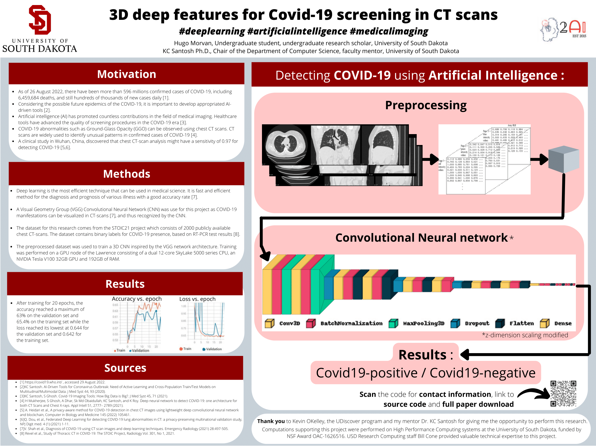

# 3D Deep features for COVID-19 screening in CT-scans

Github repository for my Undergraduate Thesis.

## Introduction

Welcome to this repository about 3D Deep features for COVID-19 screening in CT-scans. Here you will find access to:
* The [original dataset](https://registry.opendata.aws/stoic2021-training/), 
* All of the [source code](code/) used during this project, 
* The full thesis paper (coming soon). 

## Abstract

The COVID19 pandemic has caused more than 5.7 million deaths as of February 2022. With COVID-19, people could become seriously ill or die at any age. The best way to prevent and slow down transmission is to be well informed about the disease and how the virus spreads. Like predictive modeling, detecting COVID-19 positive cases (using multiple image modalities such as Computed Tomography (CT) scans and Chest X-rays (CXRs)) is the need as they provide consistent COVID-19 clinical manifestations. Considering right data use, without AI-guided tools, technological advances in biomedical and healthcare informatics may not be possible. The primary goal of the research is to study deep learning models to detect Covid-19 using CT scans. The primary research question is whether deep learning models are useful tools for mass screening.

## Methods

Deep learning is the most efficient technique that can be used in medical science. It is fast and efficient method for the diagnosis and prognosis of various illness with a good accuracy rate. As COVID-19 manifestations can be visualized in CT-scans, a Convolutional Neural Network (CNN) inspired by the Visual Geometry Group (VGG) was trained to detect the presence of COVID-19 symptoms on each CT-scan. This architecture was chosen after its performances in preliminary experimentations. As machine learning models require big data, the dataset for this research consists of 2000 publicly available chest CT-scans, which comes from the STOIC21 project. It contains binary labels for COVID-19 presence, based on RT-PCR test results . This dataset is one of the largest collections of complete CT-scans publicly available, others available in the literature contain either fewer complete CT-scans or only partial (2D slices) CT-scans.
Pre-processing was done on the dataset to normalize the volume and resize it into a constant shape suitable for neural network training. Due to big data, the use of high-performance computing machines was required. Computations supporting this project were performed on High Performance Computing systems at the University of South Dakota, funded by NSF Award OAC-1626516. The specific cluster node used for the train contains a dual 12-core SkyLake 5000 series CPU, an NVIDIA Tesla V100 32GB GPU and 192GB of RAM.

## Results

After training the Convolutional Neural Network for 20 epochs, the accuracy reached a maximum of 63% on the validation set and 65.4% on the training set while the loss reached its lowest at 0.644 for the validation set and 0.642 for the training set. 

## Discussion

The accuracy of this model in detecting the presence of COVID-19 on CT-scans shows that Deep Learning models can be useful tools for mass screening. Deep learning tools could in this case facilitate the triage of COVID-19 and nonCOVID-19 patients, and thus improve diagnosis on thoracic symptoms as well as limit the spread of the most contagious virus. In the future, this project could be combined with other well-known deep learning models trained on different image data types such as chest x-rays to employ multimodal learning and representation for COVID-19 screening. This could possibly provide more information in detecting anomaly patterns due to COVID-19. Further research could also try to improve the performances of this project by using a higher-resolution preprocessed data or by experimenting with data augmentation techniques.

## Funding

UDiscover Summer Scholars Program, University of South Dakota, Summer 2022.

## Poster

